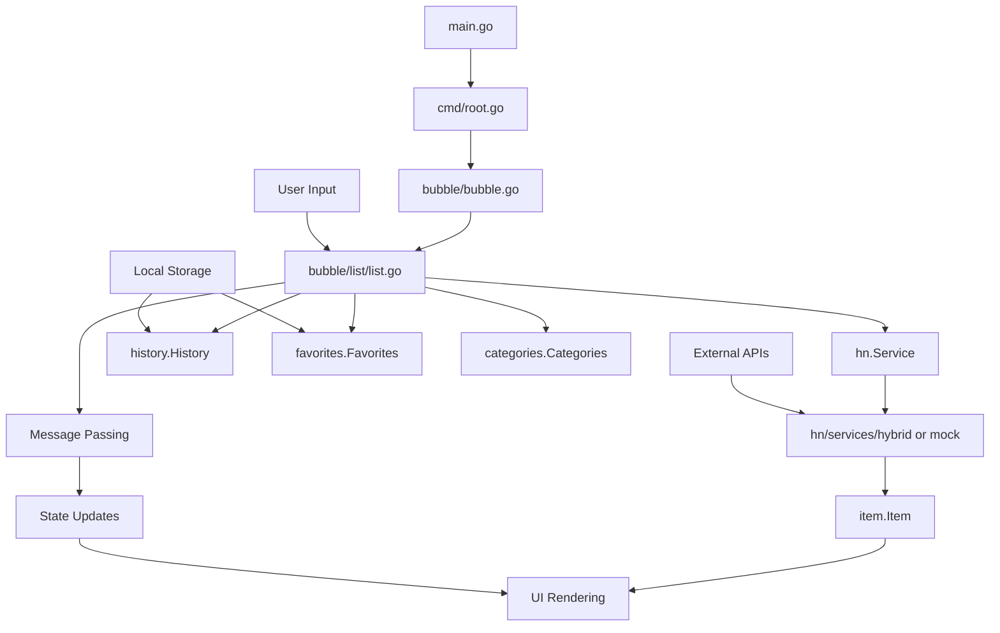

# Circumflex Project Structure Analysis

## Table of Contents
- [Overview](#overview)
- [Architecture Pattern](#architecture-pattern)
- [Directory Structure](#directory-structure)
- [Core Components](#core-components)
- [Data Flow](#data-flow)
- [Design Patterns](#design-patterns)
- [Development Guidelines](#development-guidelines)
- [Configuration & Persistence](#configuration--persistence)

## Overview

**Circumflex** (binary name: `clx`) is a terminal-based command-line tool for browsing Hacker News directly from the command line. It provides a rich, interactive text-based user interface (TUI) that integrates seamlessly with terminal workflows.

### Key Characteristics
- **Target Users**: Developers, sysadmins, and power users
- **Architecture**: Modular monolith with clear separation of concerns
- **Framework**: CLI-first approach powered by Cobra + Bubble Tea TUI
- **Language**: Go 1.25+
- **External Dependencies**: `less` pager (required)

## Architecture Pattern

The application follows a **modular monolith architecture** implementing several key patterns:

### Primary Patterns
1. **CLI-First Approach**: Powered by [Cobra](https://github.com/spf13/cobra) framework
2. **TUI Layer**: Built on [Bubble Tea](https://github.com/charmbracelet/bubbletea) (Model-View-Update pattern)
3. **Service Abstraction**: Interface-based design for interchangeable implementations
4. **Dependency Injection**: Configuration and services passed throughout the application

### Design Patterns Used
- **Command Pattern**: Implemented via Cobra commands (`add`, `clear`, `article`, etc.)
- **Model-View-Update (MVU)**: Used in Bubble Tea components for UI state management
- **Interface Segregation**: `hn.Service` and `history.History` interfaces
- **Dependency Injection**: Mockable services for testing
- **Middleware/Filter Chain**: In markdown post-processing

## Directory Structure

```
circumflex/
├── main.go                     # Application entry point
├── go.mod                      # Go module definition
├── go.sum                      # Dependency checksums
├── Dockerfile                  # Container build configuration
├── README.md                   # Project documentation
├── CHANGELOG.md                # Version history
├── LICENSE                     # License file
├── PROJECT_STRUCTURE.md        # This file
│
├── app/                        # Application metadata
│   └── app.go                 # Version, name, constants
│
├── cmd/                        # CLI command definitions (Cobra)
│   ├── root.go                # Root command with flags and configuration
│   ├── add.go                 # Add submission to favorites
│   ├── article.go             # View article by ID
│   ├── comments.go            # View comments by ID
│   ├── clear.go               # Clear history
│   ├── url.go                 # Open URL directly
│   └── version.go             # Version command
│
├── bubble/                     # TUI Framework (Bubble Tea)
│   ├── bubble.go              # Main TUI entry point
│   ├── list/                  # List component
│   │   ├── list.go           # Main list model with MVU pattern
│   │   ├── defaultitem.go    # Default list item implementation
│   │   ├── style.go          # UI styling
│   │   └── message/          # Message types for state management
│   │       └── message.go
│   └── ranking/              # Ranking display component
│       └── ranking.go
│
├── hn/                        # Hacker News service abstraction
│   ├── hn.go                 # Service interface definition
│   └── services/             # Service implementations
│       ├── hybrid/           # Production service (Official HN API)
│       │   └── hybrid.go
│       └── mock/             # Mock service for testing/debugging
│           └── mock.go
│
├── item/                      # Core data models
│   └── item.go               # Item/submission data structure
│
├── categories/                # Category management
│   └── categories.go         # Category filtering logic
│
├── history/                   # Reading history tracking
│   ├── history.go            # History interface
│   ├── persistent.go         # Persistent history implementation
│   ├── non-persistent.go     # Non-persistent history
│   └── mock.go               # Mock history for testing
│
├── favorites/                 # Favorites management
│   └── bfavorites.go         # Favorites persistence and logic
│
├── reader/                    # Article reader functionality
│   ├── reader.go             # Main reader logic
│   └── markdown/             # Markdown processing
│       ├── markdown.go       # Main markdown processor
│       ├── html/             # HTML to markdown conversion
│       │   └── markdown.go
│       ├── parser/           # Markdown parsing
│       │   └── parser.go
│       ├── postprocessor/    # Content post-processing
│       │   ├── postprocessor.go
│       │   ├── bbc.go        # BBC-specific rules
│       │   ├── wikipedia.go  # Wikipedia-specific rules
│       │   ├── rules.go      # Processing rules
│       │   └── filter/       # Content filtering
│       │       └── filter.go
│       └── terminal/         # Terminal rendering
│           └── renderer.go
│
├── comment/                   # Comment section handling
│   └── comment.go            # Comment processing and display
│
├── syntax/                    # Syntax highlighting
│   └── syntax.go             # Code, mentions, variables highlighting
│
├── tree/                      # Comment tree structure
│   ├── tree.go               # Tree processing for nested comments
│   ├── tree_test.go          # Tests
│   └── postprocessor/        # Tree post-processing
│       └── postprocessor.go
│
├── screen/                    # Screen management
│   └── screen.go             # Screen utilities
│
├── header/                    # Header display
│   └── header.go             # Header rendering
│
├── help/                      # Help system
│   └── help.go               # Help screen content
│
├── info/                      # Information display
│   └── info.go               # App information
│
├── keymaps/                   # Keyboard shortcuts
│   └── keymaps.go            # Keymap definitions
│
├── indent/                    # Comment indentation
│   └── indent.go             # Indentation visualization
│
├── meta/                      # Metadata display
│   └── meta.go               # Submission metadata
│
├── settings/                  # Configuration management
│   └── core.go               # Settings and configuration
│
├── constants/                 # Application constants
│   ├── category/             # Category constants
│   │   └── category.go
│   ├── margins/              # Margin constants
│   │   └── margins.go
│   ├── nerdfonts/            # Nerd fonts icons
│   │   └── nerdfonts.go
│   └── unicode/              # Unicode symbols
│       └── unicode.go
│
├── file/                      # File system operations
│   └── file.go               # File I/O utilities
│
├── utils/                     # Utility functions
│   ├── http/                 # HTTP utilities
│   │   └── fetcher.go
│   └── strip-ansi/           # ANSI escape code stripping
│       └── strip-ansi.go
│
├── endpoints/                 # API endpoint definitions
│   └── endpoints.go          # HN API structures
│
├── browser/                   # External browser integration
│   └── browser.go            # Browser launching
│
├── less/                      # Pager integration
│   └── less.go               # Less pager integration
│
├── cli/                       # CLI utilities
│   └── cli.go                # Command line utilities
│
├── validator/                 # Input validation
│   └── validator.go          # Validation logic
│
├── share/                     # Shared resources
│   └── asciidoctor/          # Documentation tools
│       └── convert_to_man.sh
│
└── screenshots/              # Documentation images
    └── (various PNG files)
```

## Core Components

### 1. Entry Points & CLI Layer

#### `main.go`
- Application entry point
- Initializes Cobra root command
- Simple and clean: delegates to `cmd.Root()`

#### `cmd/` Directory
- **Purpose**: CLI command definitions using Cobra framework
- **Key File**: `root.go` - Contains root command, flags, and configuration
- **Commands**: 
  - `add [id]` - Add submission to favorites
  - `article [id]` - View article by ID
  - `comments [id]` - View comments by ID  
  - `clear` - Clear browsing history
  - `url [url]` - Open URL directly
  - `version` - Show version

### 2. User Interface Layer

#### `bubble/` Directory
- **Purpose**: Terminal User Interface using Bubble Tea framework
- **Architecture**: Model-View-Update (MVU) pattern
- **Key Components**:
  - `bubble.go` - Main TUI entry point and program runner
  - `list/` - Main list component with item rendering
  - `ranking/` - Ranking display functionality

#### `bubble/list/` Package
- **Core File**: `list.go` - Main list model implementing MVU pattern
- **Responsibilities**:
  - List state management
  - Item rendering and pagination
  - User input handling
  - Integration with services and history

### 3. Business Logic Layer

#### `hn/` Package - Service Abstraction
```go
type Service interface {
    FetchItems(itemsToFetch int, category int) (items []*item.Item, errMsg string)
    FetchItem(id int) *item.Item
    FetchComments(int) *item.Item
}
```

**Implementations**:
- `hybrid/hybrid.go` - Production service using Official HN API
- `mock/mock.go` - Mock service for testing and offline development

#### `item/` Package
- **Purpose**: Core data models
- **Key Structure**: `Item` struct representing submissions/comments

#### `categories/` Package
- **Purpose**: Category management and filtering
- **Supported Categories**: Top, Best, Ask HN, Show HN, New

#### `history/` Package
- **Interface Design**: 
```go
type History interface {
    Contains(id int) bool
    GetLastVisited(id int) int64
    GetLastCommentCount(id int) int
    ClearAndWriteToDisk()
    MarkAsReadAndWriteToDisk(id int, commentsOnLastVisit int)
}
```

**Implementations**:
- `persistent.go` - Stores history to disk
- `non-persistent.go` - In-memory only
- `mock.go` - Mock for testing

#### `favorites/` Package
- **Purpose**: Manage favorite submissions
- **Persistence**: JSON file in `~/.config/circumflex/favorites.json`

### 4. Content Processing Layer

#### `reader/` Package
- **Purpose**: Article reader functionality with readability enhancement
- **Markdown Processing**:
  - HTML to Markdown conversion
  - Post-processing for specific sites (BBC, Wikipedia)
  - Terminal rendering optimization

#### `comment/` Package
- **Purpose**: Comment section processing and display
- **Features**: Nested comment handling, indentation visualization

#### `syntax/` Package
- **Purpose**: Syntax highlighting for various content types
- **Supports**: Code blocks, mentions (`@user`), variables (`$var`), URLs

#### `tree/` Package
- **Purpose**: Comment tree structure processing
- **Features**: Nested comment parsing, tree post-processing

### 5. UI Components Layer

#### Display Components
- `screen/` - Screen management utilities
- `header/` - Header rendering
- `help/` - Help system and documentation
- `info/` - Application information display
- `keymaps/` - Keyboard shortcut definitions
- `indent/` - Comment indentation visualization
- `meta/` - Submission metadata display

### 6. Infrastructure Layer

#### `settings/` Package
- **Purpose**: Centralized configuration management
- **Features**: CLI flags integration, environment variables

#### `constants/` Package
- **Categories**: Application-wide constants
- **Sub-packages**: Category definitions, margins, Nerd Fonts, Unicode symbols

#### `file/` Package
- **Purpose**: File system operations and utilities
- **Responsibilities**: JSON persistence, XDG directory handling

#### `utils/` Package
- **HTTP utilities**: HTTP client helpers
- **ANSI stripping**: Security feature to sanitize content

## Data Flow



### Data Flow Description

1. **Initialization**: `main.go` → `cmd/root.go` → `bubble/bubble.go`
2. **TUI Bootstrap**: Bubble Tea program starts with `list.Model`
3. **Data Fetching**: Service interface abstracts API calls
4. **State Management**: MVU pattern handles all state transitions
5. **Persistence**: History and favorites automatically sync to disk
6. **User Interaction**: Keymaps trigger messages that update state

## Design Patterns

### 1. Interface Segregation
- **`hn.Service`**: Clean abstraction for data fetching
- **`history.History`**: Flexible history tracking implementations
- **`ItemDelegate`**: Customizable item rendering

### 2. Dependency Injection
- Services injected based on debug mode
- Configuration passed throughout application
- Mock implementations for testing

### 3. Strategy Pattern
- Different service implementations (hybrid vs mock)
- Multiple history storage strategies
- Configurable content post-processing

### 4. Observer Pattern (via Bubble Tea)
- Message-driven state updates
- Event-based UI reactions
- Loose coupling between components

### 5. Factory Pattern
- Service creation based on configuration
- History implementation selection
- Component initialization

## Development Guidelines

### Running the Application

#### Development Mode
```bash
# Direct run (recommended for development)
go run main.go

# With debug mode (uses mock data)
go run main.go --debug-mode

# With development flags
go run main.go --debug-mode --no-less-verify --disable-history

# With Nerd Fonts support
go run main.go --nerdfonts
```

#### Production Mode
```bash
# Build binary
go build -o clx main.go

# Run binary
./clx

# With specific categories
./clx --categories=top,ask,show
```

### Testing Strategy

#### Mock Services
- Complete mock implementations available
- Offline development capability
- Consistent test data

#### Debug Mode
- `--debug-mode` flag switches to mock data
- No external API dependencies
- Faster development iteration

#### Individual Package Testing
```bash
# Run all tests
go test ./...

# Test specific package
go test ./hn/...
go test ./history/...
```

### Development Flags

| Flag | Purpose | Development Use |
|------|---------|-----------------|
| `--debug-mode` | Use mock data | Offline development |
| `--no-less-verify` | Skip less version check | Avoid system dependencies |
| `--disable-history` | Disable history tracking | Speed up development |
| `--nerdfonts` | Enable Nerd Fonts | UI testing |
| `--categories` | Set categories | Feature testing |

### Debugging Guidelines

#### Bubble Tea Components
- Focus on model state in `bubble/list/list.go`
- Debug message handling in `Update` methods
- Examine view rendering in `View` methods

#### Service Layer
- Use mock service for consistent data
- Test API integration with hybrid service
- Monitor error handling and timeout behavior

## Configuration & Persistence

### Configuration Files
- **Location**: Uses XDG Base Directory specification
- **Favorites**: `~/.config/circumflex/favorites.json`
- **History**: `~/.cache/circumflex/history.json`

### Environment Variables
- `NERDFONTS`: Enable Nerd Fonts support
- `CLX_BROWSER`: Override default browser for links

### CLI Configuration
- Extensive flag support for customization
- Runtime configuration via `settings.Config`
- Debug mode for development

### External Dependencies
- **Required**: `less` pager (version 633+)
- **Optional**: Nerd Fonts for enhanced display
- **Validation**: Automatic less version checking (can be disabled)

## Technology Stack

### Core Dependencies
- **Go**: 1.25+ (specified in go.mod)
- **Bubble Tea**: v1.3.6 - TUI framework
- **Cobra**: v1.9.1 - CLI framework
- **Lipgloss**: v1.1.1 - Styling and layout

### HTTP & Data Processing
- **Resty**: v2.16.5 - HTTP client
- **GoQuery**: HTML parsing
- **go-readability**: Content extraction
- **html-to-markdown**: Content conversion

### Utilities
- **go-pretty**: Table formatting
- **glamour**: Markdown rendering
- **go-term-text**: Terminal text handling

---

This document provides a comprehensive overview of the circumflex project structure. For specific implementation details, refer to the individual package documentation and source code comments.